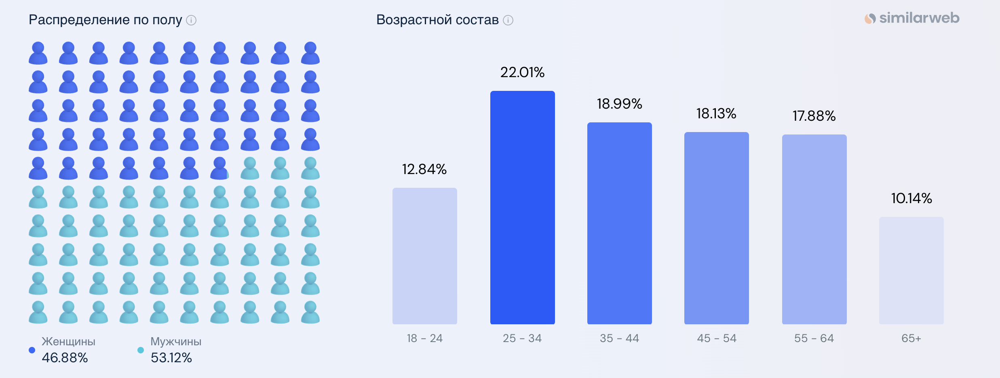
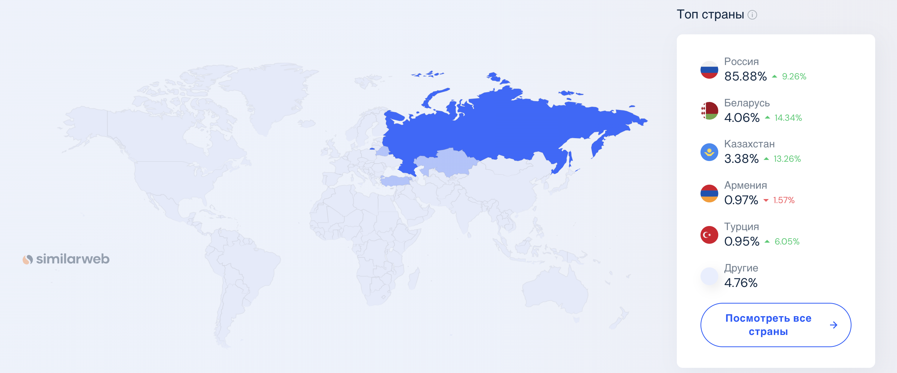
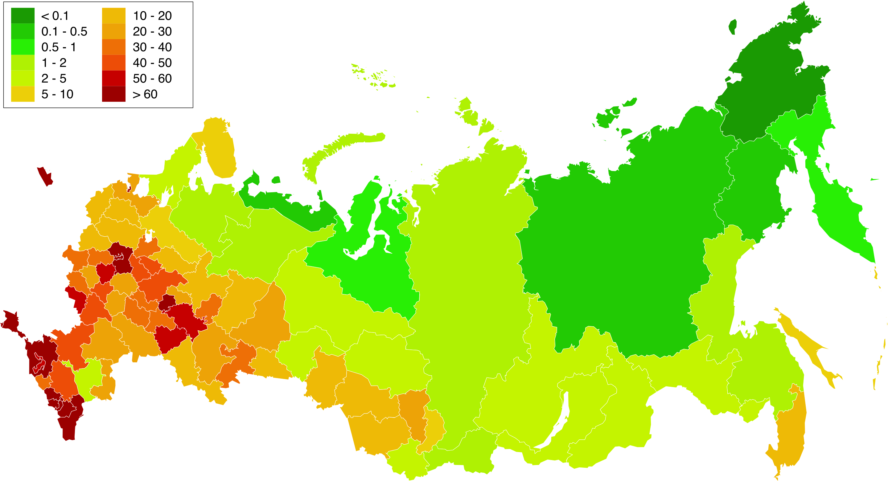
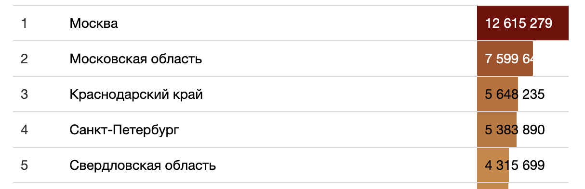

# Проектирование высоконагруженного облачного хранилища

Курсовая работа в рамках 3-го семестра программы по Веб-разработке Образовательного центра VK x МГТУ им.Н.Э.Баумана (ex. "Технопарк") по дисциплине "Проектирование высоконагруженных систем" ставит перед собой цель детального проектирования высоконагруженной системы. 

Темой работы является проектирование сервиса, схожего по функционалу с Облаком mail.

**Вся информация была взята из открытых источников**

## Содержание

- ### [1. Тема, целевая аудитория и функционал](#1_part)
- ### [2. Расчет нагрузки](#2_part)
- ### [3. Глобальная балансировка нагрузки](#3_part)
- ### [Используемые источники](#0_part)

---

## 1. Тема, целевая аудитория и функционал <a name="1_part"></a>

### Тема

Облако mail - это облачное хранилище данных российской компании VK. Позволяет хранить музыку, видео, изображения и другие файлы в облаке и синхронизировать данные на компьютерах, смартфонах или планшетах, а также делиться ими с другими пользователями Интернета.

### Целевая аудитория

Согласно информации с [hi-tech.mail.ru](https://hi-tech.mail.ru/news/102223-raskryit-obem-polzovatelskih-dannyih-v-oblake-mailru/), [similarweb](https://www.similarweb.com/ru/website/cloud.mail.ru/):

- 1 387 710 124 посещений в месяц
- 4 625 000 активных пользователей в день
- В 2023 году общий объем хранилища — более 600 петабайт данных
- За 2023 год пользователи в общей сложности загрузили более 30 млрд различных файлов
- Самая многочисленная возрастная группа посетителей: 25 - 34 лет
- В среднем, пользователи проводят на ресурсе более 5 минут за сессию
- Среднее количество страниц за визит: 4

Продукт рассчитан на СНГ рынок, поэтому рассмотрим региональную аудиторию подробнее.

#### Демография аудитории Облака mail.ru



#### Количество пользователей Облака mail.ru по странам

| Страна    | Процент пользователей от общего числа |
|-----------|---------------------------------------|
| Россия    | 85.88%                                |
| Беларусь  | 7.06%                                 |
| Казахстан | 3.38%                                 |
| Армения   | 0.97%                                 |
| Турция    | 0.95%                                 |



### Основной функционал

1. Загрузка, скачка и удаление файлов
2. Создание папок для хранения файлов (любого уровня вложенности)
3. Регистрация и аутентификация пользователей
4. Просмотр файлов (фото и документов)
5. Шеринг файлов и папок

---

## 2. Расчет нагрузки <a name="2_part"></a>

* MAU: 35 000 000
* DAU: 4 625 000
* Среднее время на сайте: 00:04:35
* Среднее количество посещенных страниц за сессию: 3.86

### Объем хранилища и типы файлов
В стандартном тарифном плане объем предоставлемого хранилища 
* 8гб для обычных пользователей 
* 1тб для платных пользоватей

Предположим что у Облака Mail примерно 50млн пользоватей. 
Допустим, что 150к из них - платные.
На основании собственного опыта и опроса знакомых диск в среднем заполнен на 2/3. 
Примерно по пропорции можно закладывать 11GB в среднем на пользователя.

**Общий размер всего хранилища**: ```11GB * 50млн ~ 524PiB.``` - сходится с [hi-tech.mail.ru](https://hi-tech.mail.ru/news/102223-raskryit-obem-polzovatelskih-dannyih-v-oblake-mailru/)

По опросам пользователей, 80% используют диск только для видео и фото. 
Для простоты будем счиать что остальные файлы это документы. 
Поскольку основной алгоритм использования это загрузка на диск фото и видео с телефона для долгострочного хранения. 
Соотношение фото к видео у меня и знакомых на телефоне примерное 8:1, будем брать такую статистику в расчетах.

| Тип файла      | Процент от всех файлов  | Средний размер |
|----------------|-------------------------|----------------|
| Фото           | 71 %                    | 5MiB           |
| Видео          | 9 %                     | 700MiB         |
| Документы      | 20 %                    | 30KiB          |

Расчитаем средний размер файла: (20% * 30KiB + 9% * 700MiB + 71% * 5MiB) ~ 67MiB


### Среднее количество действий пользователя день:

Приведем статистику которая есть от похожего сервиса - [Dropbox](https://gitnux.org/dropbox-statistics/)
- 1.2bln загружаемых файлом в день при DAU 4mln, в пересчете 300 файлов в день на пользователя
- Учитывая отличие алгоритмов загрузки файлов Dropbox и Облака mail возьмем 30 файлов в день на пользователя
- 100k создаваемых ссылок на папки, файлы при DAU 4mln в пересчете 0.6 ссылок в день на пользователя

Просмотр файла также будем считать за скачивание, так как пользователь просматривая картинку/видео/документ его скачивает.
Пусть около 5% посещений происходит с запросом авторизации. 
Среднее количество посещаемых страниц равно 4, а поскольку на диске только папки являются страницами будем брать это как просмотр содержимого папки. 
Будем считать что просматривают пользователи в 2 раза больше чем загружают, к-во удалений тоже возьмем сравнимое с загрузкой.

| Действие                    | Среднее количество дейстивий в день на пользователя |
|-----------------------------|-----------------------------------------------------|
| Аутентификация              | 0.05                                                |
| Аутентификация по куке      | 1                                                   |
| Загрузка на диск            | 30                                                  |
| Просмотр/скачивание с диска | 60                                                  |
| Удаление                    | 10                                                  |
| Создание ссылки             | 0.6                                                 |
| Просмотр папки              | 4                                                   |


### RPS

DAU = 4.625 M

RPS = DAU * количесво действий на пользователя / 86 400

```RPS = DAU * (0.05 + 1 + 30 + 60 + 10 + 0.6 + 4) / 86400 = 105 * DAU / 86400 ~ 5600```

Общее
- **RPS** ~ 5600
- **Пиковый RPS (x2.5)** ~ 14000

**RPS по типам запросов**

| Запрос                            | RPS | Пиковый RPS |
|-----------------------------------|-----|-------------|
| Аутентификация                    | 2.7 | 6.8         |
| Аутентификация по куке            | 54  | 135         |
| Загрузка на диск                  | 320 | 800         |
| Скачивание с диска                | 640 | 1600        |
| Удаление                          | 107 | 268         |
| Создание сслыки/изменение доступа | 32  | 80          |
| Просмотр папки                    | 216 | 540         |


### Расчет сетевого траффика

DAU = 4.625 M

С помощью инструментов разработчика в браузере можно посмотреть средник трафик на каждое действие пользователя. 
Все запросы не связанные с файлами будем считать размером в 5KiB. 

**Общий трафик**

Трафик будем вычислять по формуле: ```трафик_за_действие * RPS_на_действие```

```azure
Трафик в секунду = (2.7 + 54 + 107 + 32 + 216) * 5KiB + (320 + 640) * 67MiB ~ 61 Gbit/sec 
Пиковый трафик = 2.5 * 61 Gbit/sec ~ 152 Gbit/sec
```

```azure
Аутентификация = 2.7 * 5KiB ~ 13 KiB/sec
Пиковый трафик = 2.5 * 13 KiB/sec ~ 32 KiB/sec
```

```azure
Аутентификация по куке = 54 * 5KiB ~ 267 KiB/sec
Пиковый трафик = 2.5 * 267 KiB/sec ~ 668 KiB/sec
```

```azure
Загрузка на диск = 320 * 67MiB ~ 20 Gbit/sec
Пиковый трафик = 2.5 * 20 Gbit/sec ~ 50 KiB/sec
```

```azure
Скачивание в секунду = 640 * 67MiB ~ 40 Gbit/sec 
Пиковый трафик = 2.5 * 40 Gbit/sec ~ 100 Gbit/sec
```

```azure
Удаление = 107 * 5KiB ~ 535 KiB/sec
Пиковый трафик = 2.5 * 535 KiB/sec ~ 1.3 Mbit/sec
```

```azure
Создание сслыки/изменение доступа = 32 * 5KiB ~ 154 KiB/sec
Пиковый трафик = 2.5 * 154 KiB/sec ~ 385 KiB/sec
```

```azure
Просмотр папки = 216 * 5KiB ~ 1 Mbit/sec
Пиковый трафик = 2.5 * 1 Mbit/sec ~ 2.5 Mbit/sec
```

| Запрос                            | Трафик/s | Пиковый трафик/s |
|-----------------------------------|----------|------------------|
| Аутентификация                    | 13 KiB   | 32 KiB           |
| Аутентификация по куке            | 267 KiB  | 668 KiB          |
| Загрузка на диск                  | 20 Gbit  | 50 Gbit          |
| Скачивание с диска                | 40 Gbit  | 100 Gbit         |
| Удаление                          | 535 KiB  | 1.3 Mbit         |
| Создание сслыки/изменение доступа | 154 KiB  | 385 KiB          |
| Просмотр папки                    | 1 Mbit   | 2.5 Mbit         |

### Технические метрики:

Предположим, что за год DAU сервиса вырастит на 1M пользователей: ```4.625M -> 5.625M```

Прирост размера хранилище за год рассчитаем по формуле:
```(Кол-во_загрузок_в_день_на_пользователя - Кол-во_удалений_в_день_на_пользователя) * Средний_размер_файла * DAU_ср =  ```

В качестве DAU_ср возьмем 5М

Получаем:
```Прирост размера хранилища: (30 - 10) * 67MiB * DAU = 1340MiB * DAU ~ 60PiB```

Значение остальных метрик можно получить по формуле
```Значение * DAU_кон / DAU_нач ~ Значение * 1.2```

| Метрика                     | Значение   | Значение через год | Прирост за год |
|-----------------------------|------------|--------------------|----------------|
| DAU                         | 4.625M     | 5.625B             | 1M             |
| MAU                         | 35M        | 42B                | 7M             |
| Кол-во зарег. пользователей | 50М        | 60М                | 10M            |
| Общий размер хранилища      | 524PiB     | 584PiB             | 60PiB          |
| Трафик в секунду            | 61 Gbit/s  | 73 Gbit/s          | 12 Gbit/s      |
| Пиковый трафик с секунду    | 152 Gbit/s | 182 Gbit/s         | 30 Gbit/s      |
| RPS                         | 5600       | 6720               | 1120           |
| Пиковый RPS                 | 14000      | 16800              | 2800           |


## 3. Глобальная балансировка нагрузки <a name="3_part"></a>

### Функциональное разбиение по доменам

Примеры функциональных доменов:

cloud.mail.ru — Основной сервис.
cloud.imgsmail.ru — Сервис доставки медиа-контента.

### Обоснование расположения ДЦ

Целевая аудитория сервиса расположениа в России и странах СНГ => будем располагать сервера в России.


Судя по плотности населения в России


Основная часть нагрузки приходится на Центральный регион - разместим один датацентр в **Москве**.

Учитывая статистику распределения аудитории по регионам:


можно оставить один датацентр, но на случай его поломки и чтобы точно выдержать нагрузку от пользователей поставим еще один датацентр в следущем по количеству пользователей регионе - **Краснодарский край**

### DNS
Для глобальной балансировки запросов и нагрузки будем использовать latency-based DNS.
Это позволит отправлять запросы пользователя в ближайшие датацентры, которые отвечают с минимальной задержкой.

### CDN
Для снижения времени загрузки страниц и контента будем использовать CDN: контент может быть кэширован на серверах, распределенных географически, и пользователь будет получать контент с ближайшего.

## Используемые источники <a name="0_part"></a>

* https://hi-tech.mail.ru/news/102223-raskryit-obem-polzovatelskih-dannyih-v-oblake-mailru/
* https://www.similarweb.com/ru/website/cloud.mail.ru/
* https://gitnux.org/dropbox-statistics/
* https://russia.duck.consulting/maps/31/2019