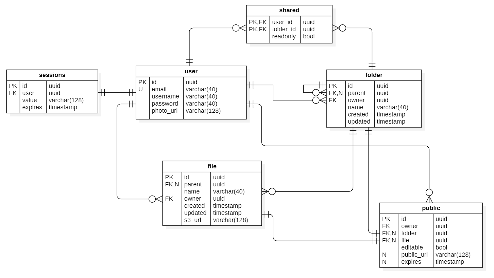
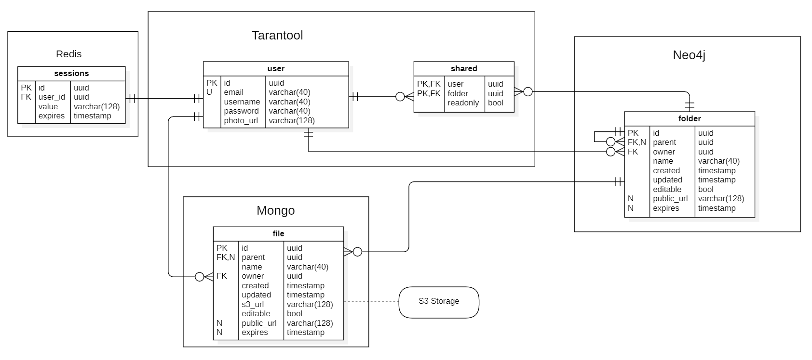
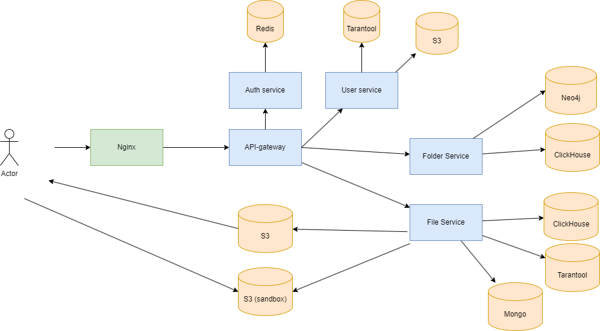

# Проектирование высоконагруженного облачного хранилища

Курсовая работа в рамках 3-го семестра программы по Веб-разработке Образовательного центра VK x МГТУ им.Н.Э.Баумана (ex. "Технопарк") по дисциплине "Проектирование высоконагруженных систем" ставит перед собой цель детального проектирования высоконагруженной системы. 

Темой работы является проектирование сервиса, схожего по функционалу с Облаком mail.

**Вся информация была взята из открытых источников**

## Содержание

- ### [1. Тема, целевая аудитория и функционал](#1_part)
- ### [2. Расчет нагрузки](#2_part)
- ### [3. Глобальная балансировка нагрузки](#3_part)
- ### [4. Локальная балансировка нагрузки](#4_part)
- ### [5. Логическая схема БД](#5_part)
- ### [6. Физическая схема БД](#6_part)
- ### [7. Алгоритмы](#7_part)
- ### [8. Технологии](#8_part)
- ### [9. Схема проекта](#9_part)
- ### [10. Обеспечение надёжности](#10_part)
- ### [Используемые источники](#0_part)

---

## 1. Тема, целевая аудитория и функционал <a name="1_part"></a>

### Тема

Облако mail - это облачное хранилище данных российской компании VK. Позволяет хранить музыку, видео, изображения и другие файлы в облаке и синхронизировать данные на компьютерах, смартфонах или планшетах, а также делиться ими с другими пользователями Интернета.

### Целевая аудитория

Согласно информации с [hi-tech.mail.ru](https://hi-tech.mail.ru/news/102223-raskryit-obem-polzovatelskih-dannyih-v-oblake-mailru/), [similarweb](https://www.similarweb.com/ru/website/cloud.mail.ru/):

- 1 387 710 124 посещений в месяц
- 4 625 000 активных пользователей в день
- В 2023 году общий объем хранилища — более 600 петабайт данных
- За 2023 год пользователи в общей сложности загрузили более 30 млрд различных файлов
- Самая многочисленная возрастная группа посетителей: 25 - 34 лет
- В среднем, пользователи проводят на ресурсе более 5 минут за сессию
- Среднее количество страниц за визит: 4

Продукт рассчитан на СНГ рынок, поэтому рассмотрим региональную аудиторию подробнее.

#### Демография аудитории Облака mail.ru


#### Количество пользователей Облака mail.ru по странам

| Страна    | Процент пользователей от общего числа |
|-----------|---------------------------------------|
| Россия    | 85.88%                                |
| Беларусь  | 7.06%                                 |
| Казахстан | 3.38%                                 |
| Армения   | 0.97%                                 |
| Турция    | 0.95%                                 |


### Основной функционал

1. Загрузка, скачка и удаление файлов
2. Создание папок для хранения файлов (любого уровня вложенности)
3. Регистрация и аутентификация пользователей
4. Просмотр файлов (фото и документов)
5. Паблик файлы и папки
6. Шеринг папок

---

## 2. Расчет нагрузки <a name="2_part"></a>

* MAU: 35 000 000
* DAU: 4 625 000
* Среднее время на сайте: 00:04:35
* Среднее количество посещенных страниц за сессию: 3.86

### Объем хранилища и типы файлов
В стандартном тарифном плане объем предоставлемого хранилища 
* 8Gbit для обычных пользователей 
* 1тб для платных пользоватей

Предположим что у Облака Mail примерно 50млн пользоватей. 
Допустим, что 150к из них - платные.
На основании собственного опыта и опроса знакомых диск в среднем заполнен на 2/3. 
Примерно по пропорции можно закладывать 11GB в среднем на пользователя.

**Общий размер всего хранилища**: ```11GB * 50млн ~ 524PiB.``` - сходится с [hi-tech.mail.ru](https://hi-tech.mail.ru/news/102223-raskryit-obem-polzovatelskih-dannyih-v-oblake-mailru/)

По опросам пользователей, 80% используют диск только для видео и фото. 
Для простоты будем счиать что остальные файлы это документы. 
Поскольку основной алгоритм использования это загрузка на диск фото и видео с телефона для долгострочного хранения. 
Соотношение фото к видео у меня и знакомых на телефоне примерное 8:1, будем брать такую статистику в расчетах.

| Тип файла      | Процент от всех файлов  | Средний размер |
|----------------|-------------------------|----------------|
| Фото           | 71 %                    | 5MiB           |
| Видео          | 9 %                     | 700MiB         |
| Документы      | 20 %                    | 30KiB          |

Расчитаем средний размер файла: (20% * 30KiB + 9% * 700MiB + 71% * 5MiB) ~ 67MiB


### Среднее количество действий пользователя день:

Приведем статистику которая есть от похожего сервиса - [Dropbox](https://gitnux.org/dropbox-statistics/)
- 1.2bln загружаемых файлом в день при DAU 4mln, в пересчете 300 файлов в день на пользователя
- Учитывая отличие алгоритмов загрузки файлов Dropbox и Облака mail возьмем 30 файлов в день на пользователя
- 100k создаваемых ссылок на папки, файлы при DAU 4mln в пересчете 0.6 ссылок в день на пользователя

Просмотр файла также будем считать за скачивание, так как пользователь просматривая картинку/видео/документ его скачивает.
Пусть около 5% посещений происходит с запросом авторизации. 
Среднее количество посещаемых страниц равно 4, а поскольку на диске только папки являются страницами будем брать это как просмотр содержимого папки. 
Будем считать что просматривают пользователи в 2 раза больше чем загружают, к-во удалений тоже возьмем сравнимое с загрузкой.

| Действие                    | Среднее количество дейстивий в день на пользователя |
|-----------------------------|-----------------------------------------------------|
| Аутентификация              | 0.05                                                |
| Аутентификация по куке      | 1                                                   |
| Загрузка на диск            | 30                                                  |
| Просмотр/скачивание с диска | 60                                                  |
| Удаление                    | 10                                                  |
| Создание ссылки             | 0.6                                                 |
| Просмотр папки              | 4                                                   |


### RPS

DAU = 4.625 M

RPS = DAU * количесво действий на пользователя / 86 400

```RPS = DAU * (0.05 + 1 + 30 + 60 + 10 + 0.6 + 4) / 86400 = 105 * DAU / 86400 ~ 5600```

Общее
- **RPS** ~ 5600
- **Пиковый RPS (x2.5)** ~ 14000

**RPS по типам запросов**

| Запрос                            | RPS | Пиковый RPS |
|-----------------------------------|-----|-------------|
| Аутентификация                    | 2.7 | 6.8         |
| Аутентификация по куке            | 54  | 135         |
| Загрузка на диск                  | 320 | 800         |
| Скачивание с диска                | 640 | 1600        |
| Удаление                          | 107 | 268         |
| Создание сслыки/изменение доступа | 32  | 80          |
| Просмотр папки                    | 216 | 540         |


### Расчет сетевого траффика

DAU = 4.625 M

С помощью инструментов разработчика в браузере можно посмотреть средник трафик на каждое действие пользователя. 
Все запросы не связанные с файлами будем считать размером в 5KiB. 

**Общий трафик**

Трафик будем вычислять по формуле: ```трафик_за_действие * RPS_на_действие```

```azure
Трафик в секунду = (2.7 + 54 + 107 + 32 + 216) * 5KiB + (320 + 640) * 67MiB ~ 61 Gbit/sec 
Пиковый трафик = 2.5 * 61 Gbit/sec ~ 152 Gbit/sec
```

```azure
Аутентификация = 2.7 * 5KiB ~ 13 KiB/sec
Пиковый трафик = 2.5 * 13 KiB/sec ~ 32 KiB/sec
```

```azure
Аутентификация по куке = 54 * 5KiB ~ 267 KiB/sec
Пиковый трафик = 2.5 * 267 KiB/sec ~ 668 KiB/sec
```

```azure
Загрузка на диск = 320 * 67MiB ~ 20 Gbit/sec
Пиковый трафик = 2.5 * 20 Gbit/sec ~ 50 KiB/sec
```

```azure
Скачивание в секунду = 640 * 67MiB ~ 40 Gbit/sec 
Пиковый трафик = 2.5 * 40 Gbit/sec ~ 100 Gbit/sec
```

```azure
Удаление = 107 * 5KiB ~ 535 KiB/sec
Пиковый трафик = 2.5 * 535 KiB/sec ~ 1.3 Mbit/sec
```

```azure
Создание сслыки/изменение доступа = 32 * 5KiB ~ 154 KiB/sec
Пиковый трафик = 2.5 * 154 KiB/sec ~ 385 KiB/sec
```

```azure
Просмотр папки = 216 * 5KiB ~ 1 Mbit/sec
Пиковый трафик = 2.5 * 1 Mbit/sec ~ 2.5 Mbit/sec
```

| Запрос                            | Трафик/s | Пиковый трафик/s |
|-----------------------------------|----------|------------------|
| Аутентификация                    | 13 KiB   | 32 KiB           |
| Аутентификация по куке            | 267 KiB  | 668 KiB          |
| Загрузка на диск                  | 20 Gbit  | 50 Gbit          |
| Скачивание с диска                | 40 Gbit  | 100 Gbit         |
| Удаление                          | 535 KiB  | 1.3 Mbit         |
| Создание сслыки/изменение доступа | 154 KiB  | 385 KiB          |
| Просмотр папки                    | 1 Mbit   | 2.5 Mbit         |

### Технические метрики:

Предположим, что за год DAU сервиса вырастит на 1M пользователей: ```4.625M -> 5.625M```

Прирост размера хранилище за год рассчитаем по формуле:
```(Кол-во_загрузок_в_день_на_пользователя - Кол-во_удалений_в_день_на_пользователя) * Средний_размер_файла * DAU_ср =  ```

В качестве DAU_ср возьмем 5М

Получаем:
```Прирост размера хранилища: (30 - 10) * 67MiB * DAU = 1340MiB * DAU ~ 60PiB```

Значение остальных метрик можно получить по формуле
```Значение * DAU_кон / DAU_нач ~ Значение * 1.2```

| Метрика                     | Значение   | Значение через год | Прирост за год |
|-----------------------------|------------|--------------------|----------------|
| DAU                         | 4.625M     | 5.625B             | 1M             |
| MAU                         | 35M        | 42B                | 7M             |
| Кол-во зарег. пользователей | 50М        | 60М                | 10M            |
| Общий размер хранилища      | 524PiB     | 584PiB             | 60PiB          |
| Трафик в секунду            | 61 Gbit/s  | 73 Gbit/s          | 12 Gbit/s      |
| Пиковый трафик с секунду    | 152 Gbit/s | 182 Gbit/s         | 30 Gbit/s      |
| RPS                         | 5600       | 6720               | 1120           |
| Пиковый RPS                 | 14000      | 16800              | 2800           |


## 3. Глобальная балансировка нагрузки <a name="3_part"></a>

### Функциональное разбиение по доменам

Примеры функциональных доменов:

cloud.mail.ru — Основной сервис.

cloud.imgsmail.ru — Сервис доставки медиа-контента.

### Обоснование расположения ДЦ

Целевая аудитория сервиса расположениа в России и странах СНГ => будем располагать сервера в России.


Основные факторы выбора расположения ЦОДов

1. Доступ к магистральным путям связи
2. Энергоснабжение
3. Климатические условия
4. Риски природных катастроф
5. Налоговые и правовые условия

Отталкиваясь от карты плотности населения России


И карты магистральных путей


Разместим датацентры в следующих местах:

* **Москва**
  * Наилучшее место для размещения ЦОД из-за высокой концентрации трафика, хорошей инфраструктуры и доступа ко многим магистральным линиям связи.

* **Санкт-Перербург**
  * Поскольку он также имеет хорошо развитую инфраструктуру и доступ к нескольким магистральным маршрутам, особенно для северных регионов.

* **Казань**
  * Центральное положение в России и доступ к множеству магистральных путей и Анапе, нежели чем в случае с Москвой и Санкт-Петербургом.

* **Новосибирск**
  * Низкие риски природных катастроф и относительно низкие цены на землю и электроэнергию.

* **Ростов-на-Дону**
  * Хороший доступ к южным регионам России и высокий уровень телекоммуникационной инфраструктуры

* **Екатеринбург**
  * Центральное положение в Урале, доступ к магистральным путям и хорошие возможности для роста.

### DNS
Для глобальной балансировки запросов и нагрузки будем использовать latency-based DNS.
Это позволит отправлять запросы пользователя в ближайшие датацентры, которые отвечают с минимальной задержкой.

### Routing

Будем балансировать запросы между ЦОДами с помощью Routing - BGP Anycast.

### CDN
Для снижения времени загрузки страниц и контента будем использовать CDN: контент может быть кэширован на серверах, распределенных географически, и пользователь будет получать контент с ближайшего.

Для экнономии средств разместим CDN в тех же местах, где и ЦОДы

## 4. Локальная балансировка нагрузки <a name="4_part"></a>

### L3 балансировщик

Балансировка на этом уровне будет производится по схеме Virtual Server via IP Tunneling

// BGP

Для обеспечаения отказоустойчивости системы стоит использовать фреймфорк Keepalived, реализующий балансировку нагрузки, мониторинг работы серверов.

Кроме того Keepalived подерживает Virtual Router Redundancy Protocol (VRRP), который и предоставляет возможность отслеживать состояние узлов системы, а при отказе одного из них перенаправить трафик на другой узел.

### L7 балансировщик
Для L7 балансировки будем использовать несколько инстансов **Nginx**
Причины:
- Лучшая производительность
- Поддержка различных протоколов(в т.ч. gRPC и HTTP)
- Открытость
- Гибкость настройки
- SSL терминация

### Отказоустойчивость
Проблему отказоустойчивости в рамках сервисов, будет решать Kubernetes. Он предоставляет механизмы для автоматического перезапуска контейнеров в случае их сбоя и обеспечивает механизмы для обнаружения и восстановления. Это позволяет быстро восстанавливать работоспособность сервисов и минимизировать простои.


## 5. Логическая схема БД <a name="5_part"></a>



// TODO: is_virus удалить

### Описание таблиц

| Название таблицы | Описание                                                                                                                                                                                                                                                                                                                      |
|------------------|-------------------------------------------------------------------------------------------------------------------------------------------------------------------------------------------------------------------------------------------------------------------------------------------------------------------------------|
| user             | Таблица users хранит данные о зарегистрированных пользователях.                                                                                                                                                                                                                                                               |
| file             | Таблица file хранит данные о файлах. Поле owner содержит FK на uuid владельца файла. Файл может быть загружен как в корень облака, так и в папку, поэтому в поле parent хранится FK Nullable uuid родительской папки. Кроме этого файл содержит название (name), дату создания (created) и дату обновления (updated)          |
| folder           | Таблица folder хранит данные о папках. Поле owner содержит FK на uuid владельца папки. Папка может быть создана как в корне облака, так и в другой папке, поэтому в поле parent хранится FK Nullable uuid родительской папки. Кроме этого папка содержит название (name), дату создания (created) и дату обновления (updated) |
| public           | Таблица public хранит данные о пабликах. Пабликом может быть как файл, так и папка. Поле owner содержит FK на uuid владельца паблика. Поле editable определяет доступ к паблику на редактирование. Поле public_url хранит ссылку на паблик, а поле expires хранит дату истечения этой ссылки                                  |
| shared           | Таблица shared хранит информацию о пошаренной папке на конкретного пользователя. Поле owner содержит FK на uuid владельца папки. FK folder хранит uuid пошеренной папки. Поле permissions определяет уровень доступа к обьекту и может принимать три значения (Редактирование / Просмотр / Доступ закрыт)                     |

### Размер данных

Размер данных в БД:

- uuid - 16 байт
- timestamp - 4 байта
- varchar(n) - n байт
- bool - 1 байт

Для подсчета количества строк в таблицах предположим, что:

- Всего файлов в облаке: размер хранилища / средний размер файла = 524 PiB / 67MiB ~ 8 400 000 000
- Папок в 10 раз меньше чем файлов ~ 840 000 000
- Пабликов в 10 раз меньше чем папок ~ 84 000 000
- Пошеренных папок в 4 раза больше чем пабликов ~ 84 000 000 * 4 = 336 000 000
- В среднем папки шарят на двух пользователей ~ 336 000 000 * 2 = 772 000 000

| Название таблицы | Количество строк | Размер строки                           | Размер данных |
|------------------|------------------|-----------------------------------------|---------------|
| users            | 50М              | 16 + 40 + 40 + 40 + 128 = 264 б         | 12,29 Gbit    |
| file             | 8 400 000 000    | 16 + 16 + 40 + 4 + 4 = 80 б             | 625 Gbit      |
| folder           | 840 000 000      | 16 + 16 + 16 + 40 + 4 + 4 = 96 б        | 75,1 Gbit     |
| public           | 84 000 000       | 16 + 16 + 16 + 16 + 1 + 128 + 4 = 197 б | 15,41 Gbit    |
| shared           | 772 000 000      | 16 + 16 + 16 + 1 = 49 б                 | 36,67 Gbit    |

## 6. Физическая схема БД <a name="6_part"></a>



### Денормализация

Для избежания лишних join'ов денормализуем схему данных
* Перенесем поля editable, public_url и expires из таблицы public в таблицы file и folder

### Выбор СУБД

#### Хранение данных

Таблицы пользователей и шаринг будет хранить в Tarantool - поскольку на эти таблицы приходится большая нагрузка на чтение и к их важно быстро уметь читать

Информацию о файлах будем хранить в MongoDB - гибкая нереляционная документоориентированная СУБД, легко масшатбируется

Для хранения папок будем использовать графовую СУБД Neo4j - она идеально подходит для реализации иерархической структуры дерева папок облака

#### Индексы

Таблица user
* user_id: hash
* email: B-tree

Таблица file
* file_id
* parent
* created

Таблица folder
* folder_id: vertex
* parent: vertex
* name: vertex
* created: vertex
* public_url: edge

### Хранение сессий пользователей

Для хранения сессий пользователей будем использовать хранилище Redis типа ключ-значение. Redis работает в памяти, что делает его значительно быстрее по сравнению с традиционными базами данных, такими как MySQL, для операций чтения и записи.

### Хранение файлов

Файлы пользователей будем хранить в S3 хранилище. S3 обеспечивает надежное хранение, быстрый доступ и удобное управление информацией, снижая затраты на инфраструктуру и обеспечивая безопасность данных.

### Хранение метрик

В качестве СУБД для аналитических задач, выберем ClickHouse. У ClickHouse есть множество преимуществ вроде высокой скорости, масштабируемости и легкости настройки.

### Мониторинг

Для мониторинга за состоянием сервисов будем использовать Grafana

### Шардирование

Для шардирования выберем таблицу file, так как на нее приходится основная нагрузка. 

Шардировать будем по юзерам

Возможные тарифы:
- Базовый 8 ГБ
- Продвинутый 124 ГБ
- Максимальный 1024 ГБ

Возьмем качества размера одного шардра размер максимального тарифа (1ТБ)

#### Алгоритм распределения пользователей по шардам

Новый пользователь региструется => ищем шард где свободно 8 ГБ => помечаем эти 8 ГБ под файлы пользователя

* Пользователь меняет размер тарифа
  * Меняет на продвинутый
    * Ищем шард, где не занято 124 ГБ
  * Меняет на максимальный
    * Выделяем пользователю отдельный шард
* Помечаем их под файлы нового пользователя
* Создаем симлинки на файлы пользователя в старом шарде
* Все новые загруженные файлы попадают в новый шард
* Переносим файлы пользователя из старого шарда в новый
* Удаляем симлинки

### Репликация

Будем использовать схему репликации Master-Slave. 

Для таблиц **users, file, folder, shared** применим схему с двумя синхронным Slave'ами,

### Клиентские библиотеки/интеграции.
Языком backend является GO и подходящие для него библиотеки:

* Tarantool - [go-tarantool](https://pkg.go.dev/github.com/tarantool/go-tarantool/v2)
* Redis - [go-redis](https://pkg.go.dev/github.com/go-redis/redis/v8)
* Neo4j - [neo4j-go-driver](https://pkg.go.dev/github.com/neo4j/neo4j-go-driver/v5/neo4j)

### Нагрузка на чтение / запись таблиц

| Название таблицы | Нагрузка на чтение | Нагрузка на запись |
|------------------|--------------------|--------------------|
| users            | Да                 | Нет                | 
| file             | Да                 | Нет                | 
| folder           | Да                 | Нет                |
| shared           | Да                 | Нет                |


## 7. Алгоритмы <a name="7_part"></a>

### Проверка файлов на вирусы

1. Загрузка файла
   * Получение файла
     * Пользователь загружает файл => файл разбивается на чанки и грузится в хранилище-песочницу (S3)

2. Анализ содержимого
   * На сервере развернут антивирусный софт [Kaspersky Anti-Virus](https://www.kaspersky.ru/antivirus)
   * Антивирус проверяет файлы, загружаемые в песочницу
     * В случае подозрения на вредоносный контент, файл удаляется из песочницы и пользователю отправляется уведомление о том, что файл не может быть загружен в облако
     * В случае чистого файла - он переносится в постоянное s3 хранилище, а пользователь может увидеть загруженный файл у себя в облаке


## 8. Технологии <a name="8_part"></a>

| Технология  |        Область применения        |                                                      Мотивация                                                       |
|-------------|:--------------------------------:|:--------------------------------------------------------------------------------------------------------------------:|
| Golang      |             Backend              | Обладает хорошим соотношением производительности, поддерживаемости и удобства. Имеет множество механизмов из коробки |
| React       |             Frontend             |                                        Стандарт индустрии, большое комьюнити                                         |
| Nginx       |         L7 балансировка          |                              Позволяет эффективно распределять нагрузку между серверами                              |
| Tarantool   |           База данных            |                                  Надежная и высокоскоростная in-memory база данных                                   |
| Neo4j       |          Графовая СУБД           |                               Поддержка древовидной структуры папок, масштабируемость                                |
| ClickHouse  |     Хранение логов и метрик      |         Ориентирован на большой поток на запись, масштабируемость,стандарт как СУБД для хранения статистики          |
| Redis       | Хранение пользовательских сессий |                         In-memory хранилище, позволяющее обеспечить быстрый доступ к данным                          |
| MinIO       |         Хранилище файлов         |                                               OpenSource реализация S3                                               |
| Gitlab      |  CI/CD, Система контроля версий  |                                     Open Source, конфигурирование, безопасность                                      |
| Kubernetes  |              Deploy              |                                 Мощный инструмент для автоматизации и развертывания                                  |

### Почему была выбрана ClickHouse

ClickHouse - колончатая СУБД (данные хранятся в виде столбцов) для онлайн-обработки аналитических запросов (OLAP)

СУБД с ориентацией на колонки были разработаны, чтобы лучше удовлетворять потребности в анализе данных.

Создание индикаторных отчетов становится проще, потому что каждая колонка содержит одну и ту же категорию информации.

Это облегчает агрегацию и анализ данных, поскольку для создания отчетов о производительности и метриках можно просто выбрать нужные столбцы, не перебирая всю строку данных.

### Отличия от Apache Cassandra

Главное различие между ClickHouse и Apache Cassandra заключается в том, что ClickHouse использует столбчатую модель хранения, тогда как Apache Cassandra использует строковую модель хранения. Это делает способ хранения и доступа к данным различным для каждой системы баз данных.

ClickHouse функционирует как база данных **OLAP**, специально разработанная для хранения и анализа данных. Ее эффективность заключается в конструкции столбчатой таблицы, что делает ее высокоэффективной для агрегации многочисленных столбцов в обширных наборах данных. 

С другой стороны, Cassandra — это база данных **OLTP**, разработанная для обработки транзакций с высокой пропускной способностью и малой задержкой. Несмотря на некоторые добавленные функции OLAP в Cassandra с течением времени, ее оптимальное использование остается в сценариях OLTP.

### Преимущества

Столбцовые СУБД лучше (от 100 раз по скорости обработки большинства запросов) подходят для OLAP-сценария работы. 

#### Строковые СУБД


#### Столбцовые СУБД


1. Для выполнения аналитического запроса требуется прочитать небольшое количество столбцов таблицы. В столбцовой БД для этого можно читать только нужные данные. Например, если вам требуется только 5 столбцов из 100, то следует рассчитывать на 20-кратное уменьшение ввода-вывода.
2. Так как данные читаются пачками, то их проще сжимать. Данные, лежащие по столбцам, также лучше сжимаются. За счёт этого, дополнительно уменьшается объём ввода-вывода.
3. За счёт уменьшения ввода-вывода больше данных влезает в системный кэш.
Например, для запроса «посчитать количество записей для каждой рекламной системы» требуется прочитать один столбец «идентификатор рекламной системы», который занимает 1 байт в несжатом виде. Если большинство переходов было не с рекламных систем, то можно рассчитывать хотя бы на десятикратное сжатие этого столбца. При использовании быстрого алгоритма сжатия возможно разжатие данных со скоростью более нескольких гигабайт несжатых данных в секунду. То есть такой запрос может выполняться со скоростью около нескольких миллиардов строк в секунду на одном сервере. На практике такая скорость действительно достигается.

## 9. Схема проекта <a name="9_part"></a>



| Сервис         |     Используемая таблица/хранилище     | 
|----------------|:--------------------------------------:|
| User service   |      Таблица `user` в Tarantool.       |
| Auth service   |      Таблица `sessions` в Redis.       |
| Folder service |       Таблица `folder` в Neo4j.        |
| File service   | Таблицы `file` и `shared` в Tarantool. |

## 10. Обеспечение надёжности <a name="10_part"></a>

| Область    | Обеспечение надежности                                                     |
|------------|----------------------------------------------------------------------------| 
| Nginx      | Rate limits + Запуск нескольких экземпляров                                | 
| Kubernetes | Динамическое масштабирование исходя из нагрузки, регулярные health check`и | 
| Mongo      | Кеш на частные запросы                                                     | 
| БД         | Репликация и шардирование                                                  | 
| S3         | Хранение данных на нескольких физических машинах                           |
| Grafana    | Настройка alert для 500 и падении сервисов                                 |

---

## Используемые источники <a name="0_part"></a>

* https://hi-tech.mail.ru/news/102223-raskryit-obem-polzovatelskih-dannyih-v-oblake-mailru/
* https://www.similarweb.com/ru/website/cloud.mail.ru/
* https://gitnux.org/dropbox-statistics/
* https://russia.duck.consulting/maps/31/2019
* https://dgraph.io/blog/post/what-information-is-indexed-by-the-graph/
